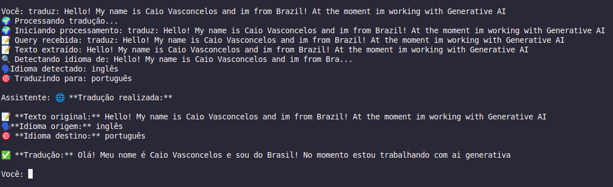
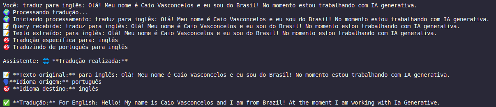
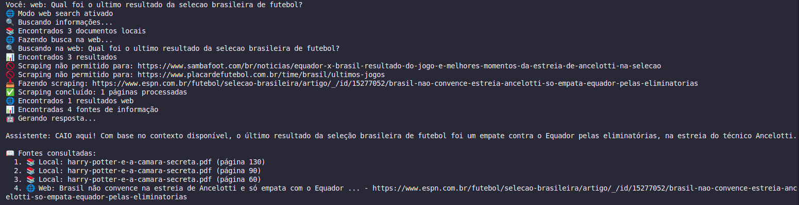

# RAG-tools
Custom Tools for llm applications extending [local-rag](https://github.com/seu-usuario/local-rag) capabilities.

## Setup

This project uses my local-rag project as a base!

So you need to make a diferent kind of clone!

* git clone --recursive https://github.com/caiovsa/RAG-tools.git

In the folder you just need to: 
``` python
poetry install
```

To use it in the code, we just need to: 
``` python 
from_rag.something import otherthing
```

## Project Idea
This is a small project just to test the creationg and usage of some AI Tools!

I just created two tools to use as example and proof of knowledge:
1. Web search tool
2. Translate tool


## Tools
 - **Web Search**: Make web searches
 - **Translate**: Make simple translations

## Usage

``` python
poetry run python enhanced_chat.py
```

### Translate Tool
traduz: Hello, how are you? (Calls the translate tool)


traduz para inglês: Ola, como voce esta? (Calls the translate tool)



### Web search Tool
web: Latest news about the X soccer team

